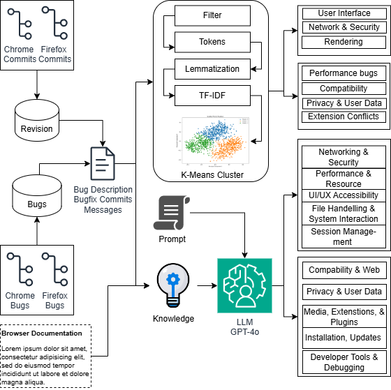

# Bug Analysis in Modern Web Browsers

## Overview
This repository contains the code and resources for the research paper titled "Bug Analysis in Modern Web Browsers: A Study of Firefox and Chromium." The study employs natural language processing (NLP) techniques to categorize and analyze bugs in Firefox and Chromium, providing insights into common defects and defect-prone components.

## Contents
- **Data Collection**: Scripts for collecting bug data from GitHub repositories of Firefox and Chromium.
- **Preprocessing**: Code for cleaning and preparing the data for analysis.
- **NLP Analysis**: Implementation of the BERT model for clustering bug descriptions and generating word clouds.
- **Visualization**: Tools for visualizing bug clusters and defect patterns.
- **Results**: Analysis scripts that summarize the findings of the research.

Methodology 

Our methodology consisted of several stages to analyze and categorize bugs in Chrome and Firefox using Natural Language Processing (NLP) and clustering techniques.



Data Collection & Pre-processing:

We collected bug descriptions and component information from bug reports, forming a relational table to link bugs to affected components.
Commit data from Git repositories was linked to bugs by extracting bug IDs and labeling commits with component names based on file paths.
NLP & Tokenization:

We pre-processed the text by removing stop words, tokenizing, and lemmatizing bug descriptions to prepare for analysis.
Using TF-IDF, we calculated word importance, filtered irrelevant words, and identified key terms for clustering.
Clustering & Thematic Analysis:

We used K-Means clustering and Principal Component Analysis (PCA) to group similar bugs, identifying clusters based on token patterns.
We conducted thematic analysis and inter-rater reliability checks to finalize categories for bug types.
Knowledge Embedding:

Using OpenAI embeddings, we created vector representations of bug descriptions and commit messages to capture relationships between bugs and components.
This approach allowed us to categorize bugs effectively and assess the model’s understanding of browser-specific bug patterns.


## Installation
1. Clone the repository:
   ```bash
   git clone https://github.com/singhrahulbrijesh/common-defect-in-browsers.git
Navigate to the project directory:
bash


cd repo-name
Install the required packages:
bash


Contributions
Contributions are welcome! Please feel free to submit a pull request or open an issue for any enhancements or bug reports.

License
This project is licensed under the MIT License. See the LICENSE file for details.

Acknowledgments
Thanks to the contributors of the Firefox and Chromium projects for their open-source efforts, which made this research possible.

Contact
For any inquiries, please reach out to me at singhrahulbrijesh@gmail.com.


Feel free to modify the content to suit your specific project details!
